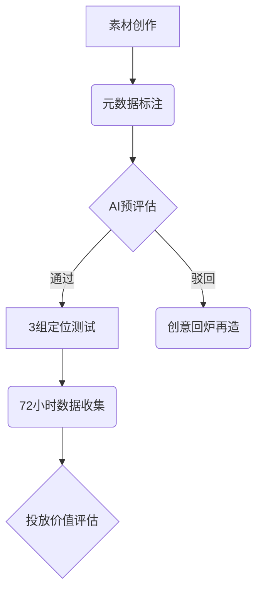

# Facebook广告运营体系优化方案

---

## 运营体系分层管理策略
### 1.1 账户三阶架构模型
**核心账户层（日均$2000+）**
- 智能预算分配器自动匹配TOP3受众
- 素材库实施ABC分级管理（S级素材优先展示）
- 配备双重域名容灾系统

**实验账户层（日均$300-800）**
```python
测试策略 = {
    "新品类拓展": "$500/日市场探测费",
    "创意迭代": "30组素材/周更新计划",
    "流量入口": ["Instagram Reels", "Facebook Feed", "Marketplace"]
}
```

---

## 动态预算智能调节体系
### 2.1 三阶调控机制
| 调控维度     | 实时干预条件                | 处置方案                        |
|--------------|---------------------------|--------------------------------|
| CPM异常波动  | 连续3小时涨幅≥18%         | 强制暂停 → 23:00重启新组 [2]    |
| CTR衰减状态  | 日环比降幅≥25%            | 触发AB测试紧急预案（3组备选）  |
| 转化成本失衡 | 超基准值22%持续6小时      | 启动动态出价补偿算法            |

### 2.2 风险对冲方案
```javascript
function riskControl(budget) {
  const safetyNet = budget * 0.15;
  if (ROI < 1.8) {
    activateContingency(safetyNet);
    adjustAudience('拓展5%相似受众');
  }
}
```

---

## 合规运营与安全保障
### 3.1 多维度防护矩阵
| 防护层级     | 技术措施                  | 管理规范                      |
|--------------|-------------------------|-----------------------------|
| 账户安全     | 三模态生物认证           | 设备白名单制度               |
| 内容安全     | AI预审7大风险维度        | 双审机制（机审+人工）       |
| 资金安全     | 虚拟卡动态限额           | 异常支付熔断设置            |

---

## 全周期素材优化工坊
### 4.1 创意自动化测试流程


### 4.2 素材竞争力指数
```mathematica
素材指数 = (播放完成率×0.4 + CTR×0.3 + 转化率×0.3) × 风险系数
当指数 ≥7.5时：
   激活跨平台投放模块
   开启智能变体生成器
```

---

## 再营销技术策略
### 5.1 用户挽回策略金字塔
| 用户层级       | 交互特征                | 挽回策略                | 执行周期   |
|----------------|-------------------------|-------------------------|------------|
| 浏览未转化     | 页面停留<30秒           | 强利益点再曝机制        | 7日内      |
| 深度互动用户   | 视频观看≥75%+评论       | 专属客服介入            | 72小时内   |
| 放弃支付用户   | 购物车留存≥2小时        | 限时折扣+免邮组合       | 12小时内   |

---

## 长效运营监测机制
### 6.1 核心监控指标仪表盘
| 监测维度       | 预警阈值               | 处置动作                 |
|----------------|------------------------|-------------------------|
| 素材同质化率   | ≥35%持续3天           | 强制创意升级程序         |
| 自然流量占比   | ≤15%周均               | 启动UGC激励计划         |
| 用户忠诚度     | 复购率<12%季度         | 推出VIP层级体系         |

### 6.2 应急预案体系
- 每日04:00资产云备份
- 10分钟快速迁移能力：
  1. 域名系统自动接管
  2. 高价值素材即时转移
  3. 已验证受众无缝衔接

> **运营提示**：每日10:00/16:00/22:00执行三轮数据校准，每周一进行全域健康状况扫描。重大策略调整需保留72小时观察期并设置5%预算对照组。
> [教学视频](https://youtube.com/shorts/Wp5W2wo9RMg?feature=share)
